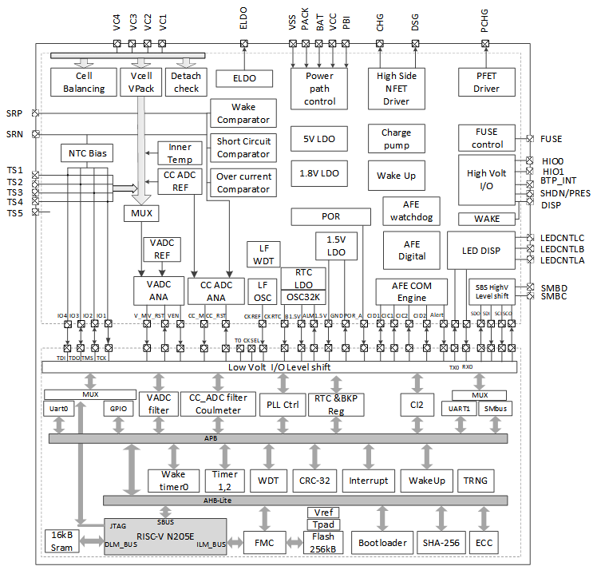

Simplified functional state diagram
===================================

graphviz
######
.. graphviz:: ../code/graphviz/fsm.gv

graphviz1
#########

.. graphviz:: ../code/graphviz/fsm1.gv

Power sequencing
================

.. graphviz:: ../code/graphviz/power_sequencing.gv

Debug mode entry
=================
.. wavedrom:: ../code/wavedrom/Debug_mode_entry.json

image
============

excel
=========
.. excel:: ../excel/tables.xlsx
   :caption: registers summary
   :headers: 1
   

